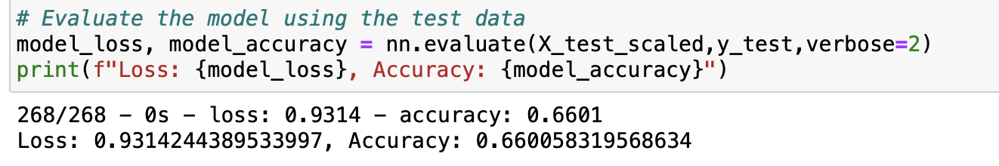
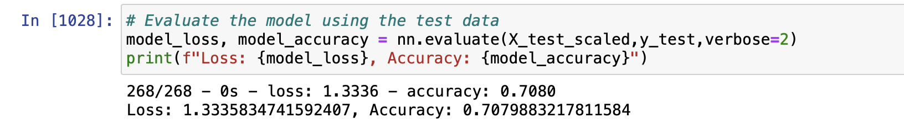

# Neural_Network_Charity_Analysis
## Overview
The purpose of this project is to create a binary classifier that is capable of predicting whether applicants will be successful if funded by Alphabet Soup.
pandas and tensorflow were used to develop neuro networks that performed the binary classifiers and prediction.
## Results
Data Preprocessing
- The target variable is 'IS_SUCCESSFUL
- The features variables are APPLICATION_TYPE, AFFILIATION, CLASSIFICATION, USE_CASE ,ORGANIZATION, INCOME_AMT, SPECIAL_CONSIDERATIONS  
- EIN and NAME are considered as neither features nor target, therefore, they are dropped from the dataframe.
Compiling, Training, and Evaluating the Model
- 2 layers with 80 neurons for layer1 and 30 neurons respectively were used.ReLU activation function for layers and sigmoid function for output layer were selected for the neural network model so as to avoid overfitting. Because the more the layers the higher the tendency for over fitting.
- However the model accuracy was 66%
- 
After removing the ASK_AMT variable from the features,  reducing the bins on both Application_type and Classification and reducing the neurons in each layers to 20 and 10 neurons in layer1 and layer2 respectively. The model accuracy increased to 71%

## Summary
